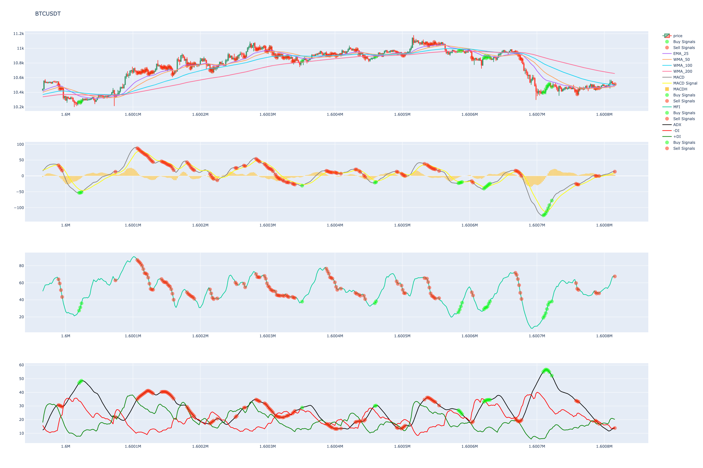

# StrategyCheck

simple tool to visualize/check trading strategy so you can use it with your trading bot :]

Currently only for Binance. If you need an account:
[Register on Binance](https://www.binance.com/en/register?ref=23830900)

## Features

### set conditions to filter the data (conf.py)

| attribute | description |
|-----------|-------------|
| min_volume | minimum quote asset volume per 24h |
| quote_asset | quote asset to use (USDT for BTCUSDT)|
| candle_interval | candlestick interval (30 minutes default) |
| days | how many days to look back? (default 14) |
| ignore_assets | which assets to ignore entirely |
| add_indicators | dataframe name of indicator as key, position in plotly as value |

### use TA-Lib and custom indicators

- edit indicators in marked area in gen_candles.py
- to smooth your values put the desired indicator into EMA, MA, ...

### saves all data as csv and generates webpage for further examination (plotly):
- green dots indicate a long signal
- red dots indicate a short signal

## Used Libraries

[pandas](https://github.com/pandas-dev/pandas)

[python-binance](https://github.com/sammchardy/python-binance)

[TA-Lib](https://github.com/mrjbq7/ta-lib)

[plotly](https://github.com/plotly/plotly.py)
