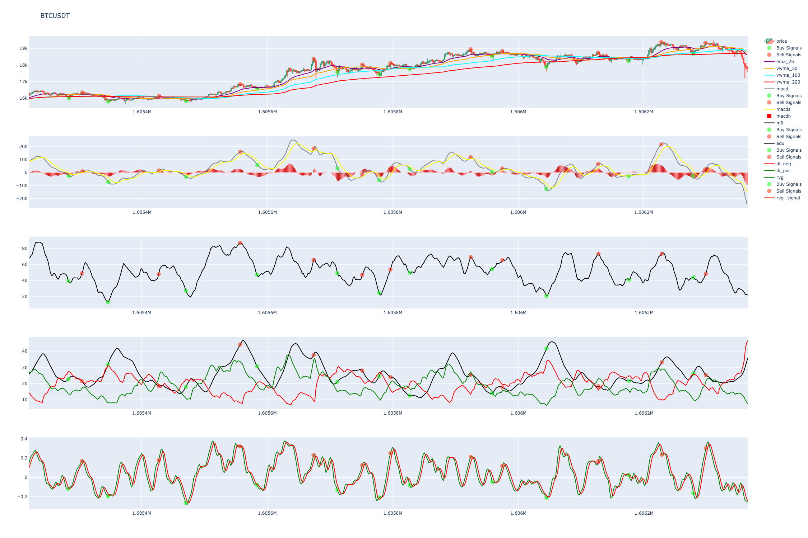

# StrategyCheck

simple tool to visualize/check trading strategy so you can use it with your trading bot :]

Currently only for Binance. If you need an account:
[Register on Binance](https://www.binance.com/en/register?ref=23830900)

## Usage

1. set your configuration in settings.json
2. set your strategy in strategy.py
3. run main.py

## Features

### use TA-Lib and custom indicators

- edit indicators in marked area in gen\_data.py within gen\_ta\_candles() method

Note: To smooth your values put the desired indicator into EMA, MA, ...

### saves all data as csv and generates webpage for further examination (plotly):
- green dots indicate a long signal
- red dots indicate a short signal

## Configuration 

All configuration changes must be made in settings.json
	
### FilterSettings
	
|property name| desription |
|---------------------|------------|
| Min\_Volume | minimum quote asset volume per 24h |
| Quote\_Asset | quote asset to use (e.g. USDT for BTCUSDT) | 
	
#### ExchangeSettings

|property name| desription |
|---------------------|------------|
| Candle\_Interval | candlestick interval (30 minutes default) |
| Days\_to\_look\_back | how many days to look back? (default 14) |
| Ignore\_Assets | which assets to ignore entirely |

### IndicatorSettings

|property name| desription |
|---------------------|------------|
| Add_Indicators | settings for all indicators to be included in the graph  |

#### `IndicatorSettingss.Add_Indicators`
	
settings for all indicators to be included in the graph

- **Row**: which row in the graph the indicator should be placed in
- **Color**: the plot color of the indicator
- **Plot\_Type**: either "scatter" or "bar"
- **Add\_Signal**: should buy/sell signal within the indicator be marked in the plot?

## Used Libraries

[pandas](https://github.com/pandas-dev/pandas)

[python-binance](https://github.com/sammchardy/python-binance)

[TA-Lib](https://github.com/mrjbq7/ta-lib)

[plotly](https://github.com/plotly/plotly.py)
